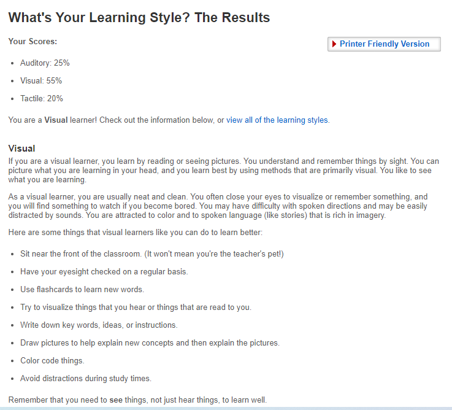

<html>
<head>
<h1>Assignment 1</h1>
<h1>Suzhi Li</h1>
<h1>S3789222</h1>
</head>
<body>
  <h3>My personal information:</h3>
  
My name is Suzhi Li and my student ID is s3789222. <a href="mailto:s3789222@student.rmit.edu.au">s3789222@student.rmit.edu.au</a> is my study email address but in my personal time, I like to use <a href="mailto:1732709168@qq.com">1732709168@qq.com</a> and <a href="mailto:a1732709168@gmail.com">a1732709168@gmail.com</a>. I come from China. If you cannot or find it difficult to say my name, you can call me ‘Sushi’, it is my English name. It is a bit interesting how it became my English name. When I studied in Singapore, the teachers were difficult to say my original name so they chose a similar word, ‘sushi’, to call me. I did not know the meaning at that time and when I knew that meaning, it was too late. However, ‘Sushi’ is good and I like sushi so it became my English name. My hobbies are quite extensive, I like to play video games, watch anime, cook food, do some exercise, read books and even try to write some stories. I am passionate about completing the work which I am doing. In other words, it may be difficult to start a work but if I begin to do it, I can keep paying attention to it until it finishes or my mind protests. I did not study too much about Information Technology, so I am looking forward to learn more about it in further study.

  
This is (was) what am I look like:(I become heavier...just a little)

  
  <h3>Interest in IT:</h3>
  
Just like I say before, I do not know much about Information Technology, the only understanding about IT is that it is about data transmission, reserve, management and communication. Based on these features, it can be dispersed to many different parts like economy, engineering, social and the part that I most interes, game design. I like video games from a very young age, maybe five years old but at that time, the interes only rested on playing it. The interest turned from ‘play’ to ‘design’ at my high school. At seventeen years old, I transferred to Overseas Family School in Singapore from China. In that school, my teacher gave me a sheet to let me choose which subject I wanted to study. Then, I began to think about what I want to do in the future and in that time, I understood I wanted to create some interesting, meaningful, popular games. After that, I tried to study some knowledge about game design, I learned some skills and knowledge about 3D models created by myself, but I knew it is not enough, I have so much need to learn. That is why I design to study Information Technology. 

  
One reason why I choose to study in RMIT is by my best friend’s recommendation. In my high school, we lived together in the same host family. He knew my goal and tried to help me.  He found RMIT on the internet and referrals to me. Then I began to search for information about RMIT. I found that RMIT has the subject that I need and it is at the top of the world. Thus I design to study in RMIT. The funny thing is I try to invite other friends to come with me and they answer me ‘yes’ but in the end, only me come here, I feel pitiful for them because they miss a good University. it is their loss.

One reason why I choose to study in RMIT is by my best friend’s recommendation. In my high school, we lived together in the same host family. He knew my goal and tried to help me.  He found RMIT on the internet and referrals to me. Then I began to search for information about RMIT. I found that RMIT has the subject that I need and it is at the top of the world. Thus I design to study in RMIT. The funny thing is I try to invite other friends to come with me and they answer me ‘yes’ but in the end, only me come here, I feel pitiful for them because they miss a good University. it is their loss.

<h3>Idea Job:</h3>

For my ideal job, I found one on a website called ‘seek.com.au’. I believe that my idea job should at least look like it:

<a href="https://www.seek.com.au/job/51769594?type=standard#searchRequestToken=f71ed8bd-fd3a-4742-a8f0-fd406dc16540">Link is here</a>

In my own words, in this job, I need to work with my teamwork to write the base code of a game, to build the character model and make it run successfully. In this job, I can learn more knowledge and experiment in design games and have a chance to learn more useful skills from other people. I understand my final goal is to create my own workroom and my own games, thus jobs like this are very important for me.

To acquire this job, I must have enough skill in programming, I need to use programming languages like C, C++ and python expertly. I need to know how to build useful 3D modules and UI. For further development, I also need to understand information transmission, store and management.

However, I understand I do not have enough skills. For 3D module creation, I do not accept systematic study and I only can create some base modules like daily living equipment and simple living rooms. For programming, I only know the base of C++ and Java. For information transmission, store and management, they are new for me. Thus, in further study, I need to pay more attention to these parts.

So in university life. I need to finish the subject that I chosed. I need to spend more time on enhancing programming skills. I need to find more books about Information Technology and expand my knowledge reserve. On the weekend, I need to ask my other friends to know more skills or knowledge that I need but out of my study. When I have some problem, I also need to ask teachers and other upperclass students to solve them as fast as I can.

<h3>Personal Profile:</h3>

<h3>result of an online Myers-Briggs test:</h3>

Firstly, I am a...

It means...

It doesn’t interest me what you do for a living. I want to know what you ache for – and if you dare to dream of meeting your heart’s longing. It doesn’t interest me how old you are. I want to know if you will risk looking like a fool – for love – for your dreams – for the adventure of being alive.

The Campaigner personality is a true free spirit. They are often the life of the party, but unlike types in the Explorer Role group, Campaigners are less interested in the sheer excitement and pleasure of the moment than they are in enjoying the social and emotional connections they make with others. Charming, independent, energetic and compassionate, the 7% of the population that they comprise can certainly be felt in any crowd.

For others......

<h3>result of an online learning style result:</h3>

<h3>result of online Big Five Personality test:</h3>

This Big Five assessment measures my scores on five major dimensions of personality: Openness, Conscientiousness, Extraversion, Agreeableness, and Neuroticism (sometimes abbreviated OCEAN).

In my opinion, the result helps me to understand myself more deeply. I believe that I cannot judge myself fairly because I will bring some subjective consciousness to view myself, it will make me unable to see myself. These tests and results give me a chance to know myself from some parts, I believe that they will help me in further studying and working with my teammates.

I think these results may influence my behaviour in a team because I exactly did and read these results. I will think of them in my subconsciousness thus it will make some influence in my behaviour but I believe that these influences are positive.

When forming a team, these results will help me to select the teammates. It will help me to form an effective team. Moreover, based on the results, they can help me to prepare for potential problems and mistakes. Sometimes, I can use the result to solve the conflict and build stronger relationships with other teammates.

<h2>Project idea:</h2>

<h3>Overview:</h3>

For my final goal, I want to create some interesting, meaningful, popular games. They should like some virtual world but let the players feel real. I want the player to feel happy, hopeful even perception of affiliation in my games. However, for now I do not have enough ability and experiments to create these worlds. Thus for now, my chiefly goal is to create a game that will have the function I want but not so difficult. For this project, I want to create a game based on the type of a board game: Call of Cthulhu. The player needs to use the search skill and art of speaking to find enough clues to find the truth which hides behind the mystery, then try to survive.

<h3>Motivation:</h3>

There are many reasons except I like games of why I want to create this project. Firstly, the popularity of video games are undoubted. When I was a foundation student, my partner and I did a research of the sales volume of games in 2019, the most three popular games have a total sales volume of 400 millions salling. Game business is a huge opportunity. Secondly, Call of Cthulhu is a popular culture too, there are many famous game use for reference this culture like WOW, Blood Cure and The Elder Scrolls eth. Third, the project has some riddle and exploration elements. I can use them in the future to reach my final goal.

<h3>Description:</h3>

In this project, I want to narrate a story of a mystrious murder case. In the beginning, the players can choose which profession they want to be. In my original plan, they can choose three professions: a detective, the friend of the victim or a police officer who comes to inquire about the case. Moreover, each player will have extra skill points to complete their character. In the experimental stage project, I do not plan to give too much choice for the skills. Maybe just some basake skills like ‘search’, ‘persuade’, ‘menace’, ‘punch’, ‘dodge’, ‘library’(based on the Call of Cthulhu rule, it means searching books) etc. To distinguish each profession, I will give them different initial skill points and upper limits like a detective will have skillful ‘search’ ability and the police officer will have strong battle skills. Moreover for each profession, they will have their own advantages and disadvantages in this case. To be a detective, although he has a strong ability to search clues but be a stranger in the residential building, the residents may feel uncomfortable helping him. For the friend of the victim, the one does not have strong ability in finding clues, but he is familiar to all residents so they will try their best to help him even tell some clues that they know and feel may be helpful. For the police officer, he may be just in the middle.

In the searching part, everyone will have a ‘search’ button, they can use the ability to search the clues under the sundries. When they use the skill, the clues which near them will be shining, more familiar of the ability, more bigger searching area and less cooling down times.The skill of ‘library’ will be the same but it will focus on the book racks.

In the asking part, the player will ask the neighborhood to find the clues, the player can choose some sentence to communicate with them like the game ‘The Witcher’, more familiar of the ‘persuade’, more sentence can choose. Of course, if the player chooses to be the friend, they do not need the ‘persuade’. Maybe Someone does not choose the right sentence so the neighborhood does not want to talk anymore, they can choose to use some skills like ‘menace’ or ‘punch’ but the result will be almost lost the chance to communicate with other neighbors.

In the end, the players will find the truth: like the traditional Cthulhu story, someone tries to summon one of the Great Old Ones but fails and becomes a Crawling Ones (one of a COC monster, based on the COC rule, the player will not know the name). Then the players need to make the decision: escape or fight with the monster to save everyone and their decision will create different ends. In my original plan, the player may have these ends like they escape and tell the police officer to clean the building, but the neighborhood is not lucky like them.They successfully persuade everyone,player and every NPC successfully escape from the building etc. Moreover, I also plan to create a ‘clock’ to warn the player and when the time goes run, they will be forced to join some plot.

<h3>Tools and Technologies:</h3>

To complete my project, I also need some tools and technologies. Firstly, I need a hard disk to hold and store the information which I need. Secondly, I need a sharing document where I can write the main plot and share ideas with my teammates. Thirdly, I need a game design application like Unity. Fourthly, I need to have the 3D module create applications like Blender or 3DS MAX etc. Moreover, for the last two tools, I also need to find useful courses on the Internet.

<h3>Skill Required:</h3>

For the skills I need. Based on my knowledge. To design a game always needs three parts: plan, programming and art design. In the plan part, I need to have a skill to tell a story and set the plot to let the player play. Luckily I already have some experience writing a story and writing some COC modules to play with my friends. In the programming part, it is my most important part. I need to have enough programming language skills like python, C++ or Java,  to write and run a program. In the art design part, I need to have skill to create 3D models and add them into the game design application.

<h3>Outcome:</h3>

If the project is successfully completed, it expresses that I have the basic ability to design a game and I have skill and ability to take the next step even means I may have more possibility to find the job that I like and need. Moreover, For myself , it also symbolizes that I have taken the first step for my final goal because my final goal is to create a virtual world but let the player feel real, I can use the communication and feed back system in my future study.

</body>
</html>
